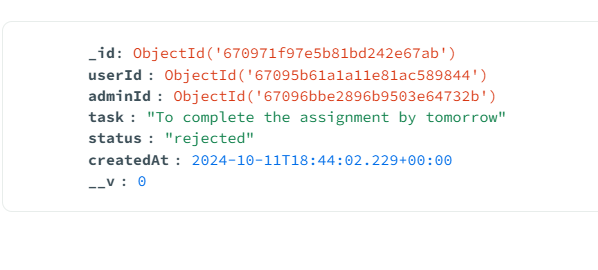
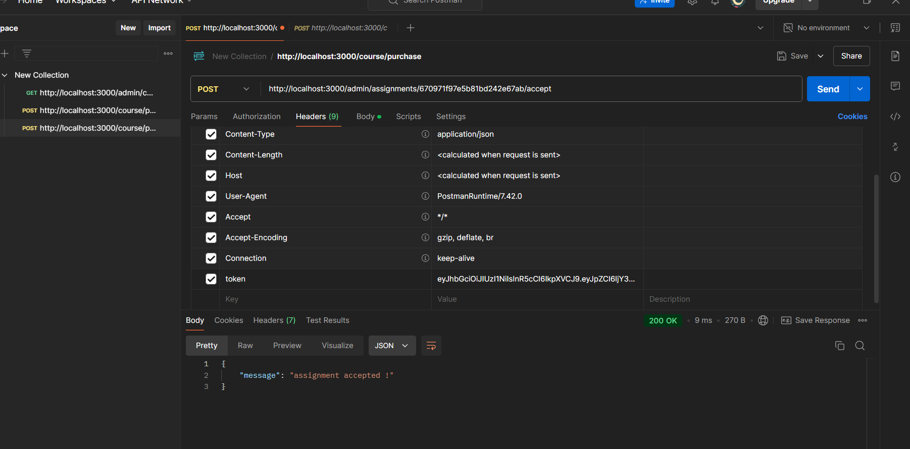

# Assignment for Backend Developer Intern # 


## Project Overview

This project is a **Node.js** application that provides a **REST API** for managing users and admins in an assignment system. It uses **MongoDB** for data storage and integrates **JWT-based authentication** for securing routes. Additionally, **bcrypt** is used for password hashing, and **Zod** is used for input validation.

The application has two primary modules:

- **User module**: For users to register, login, upload assignments, and interact with the system.
- **Admin module**: For admins to register, login, view assignments, accept, or reject tasks.

### Key Features:
- **User registration and login** with hashed passwords using `bcrypt`.
- **JWT-based authentication** for secure login and token validation.
- **Admin role-based access** to view and manage assignments.
- **Assignment management** for admins to accept or reject tasks.
- **Input validation** using the `Zod` library to ensure the correct data format.

## Project Structure


## Installation

### Prerequisites

- Node.js >= 14.x
- MongoDB

### Steps to Install

1. **Clone the repository**:
   ```bash
   git clone https://github.com/priyaanshusoni/Backend-Developer-intern-Assignment.git
   
2. **install dependencies**:
   ```bash
   npm install
3. **Set up environment variables:**
  Create a .env file in the root of the project and add the following:
   ```bash
   PORT=5000
   JWT_SECRET=your-secret-key
   DATABASE_URL=mongodb://localhost:27017/test
3. **Start the server:**

   ```bash
   npm start

   

## API endpoints
### USER ENDPOINTS
1. **USER ENDPOINT** (/user/register)


   ***POST REQUEST***
   It registers a user


   Request Body


   
    ```bash
     json
    {
    "email": "user@example.com",
    " firstName": "John",
    " lastName": "Doe",
   "password": "password123"
   }
2. **USER ENDPOINT** (/user/login)


   ***POST REQUEST***
   login the user


   Request Body


   
    ```bash
     json
    {
    "email": "user@example.com",
   "password": "password123"
   }
3. **USER ENDPOINT** (/user/upload)


   ***POST REQUEST***
   user upload the assignments


   Request Body


   
    ```bash

     json
    {
       "task": "Task description",
       "adminEmail": "admin@example.com"
   }
4. **USER ENDPOINT** (/user/admins)


   ***GET REQUEST***
   User can fetch all the admins


### ADMIN ENDPOINTS
1. **ADMIN ENDPOINT** (/admin/register)


   ***POST REQUEST***
   It registers a admin


   Request Body


   
    ```bash
     json
    {
    "email": "admin@example.com",
    " firstName": "John",
    " lastName": "Doe",
   "password": "password123"
   }
2. **ADMIN ENDPOINT** (/admin/login)


   ***POST REQUEST***
   login the admin


   Request Body


   
    ```bash
     json
    {
    "email": "admin@example.com",
   "password": "password123"
   }
3. **ADMIN ENDPOINT** (/admin/assignments)


   ***GET REQUEST***
   View assignments tagged to the admin.


   
4. **ADMIN ENDPOINT** (/admin/assignments/:id/accept)


   ***POST REQUEST***
   admin can accept the assignment


     

5. **ADMIN ENDPOINT** (/admin/assignments/:id/reject)


   ***POST REQUEST***
   admin can reject the assignment
   [Refer above image]


## Video ##


